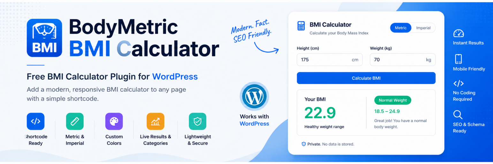
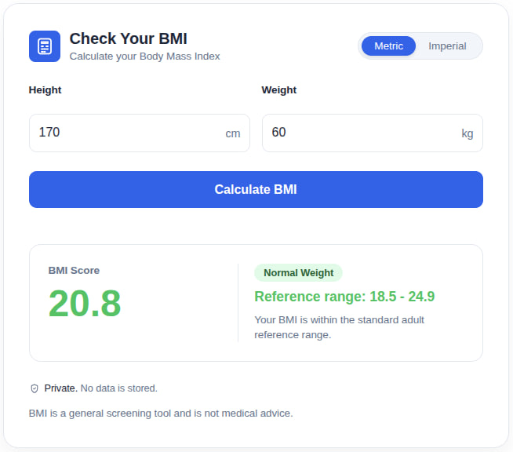
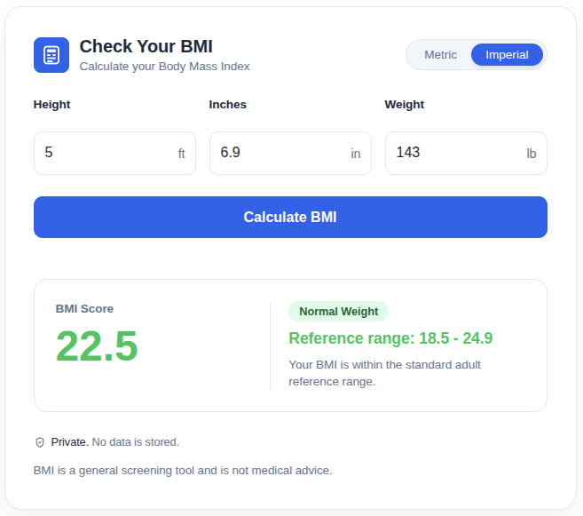
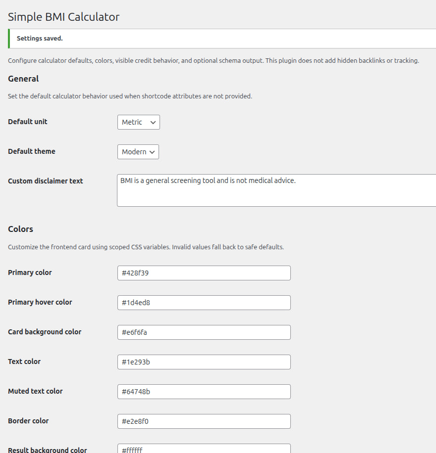

# BodyMetric BMI Calculator

A lightweight WordPress BMI calculator plugin with metric and imperial units, custom colors, optional schema markup, and shortcode support.




## Overview

BodyMetric BMI Calculator helps WordPress site owners add a clean, modern BMI calculator to posts, pages, landing pages, health blogs, fitness websites, wellness sites, and clinic websites using a simple shortcode.

The plugin is built for lightweight shortcode-based integration and includes support for metric and imperial units, configurable design options, optional schema markup, and privacy-friendly frontend behavior with no tracking.

Website: [bodymetriccalculator.com](https://bodymetriccalculator.com/)

Landing page: [bodymetriccalculator.com/bmi-calculator](https://bodymetriccalculator.com/bmi-calculator)

## Features

- Modern BMI calculator card
- Metric and imperial BMI calculation
- Metric inputs: height in cm and weight in kg
- Imperial inputs: height in feet, height in inches, and weight in pounds
- Metric / Imperial unit toggle
- Live BMI result updates in the browser
- BMI category badge
- Neutral BMI feedback text
- Custom color settings from the WordPress admin area
- Optional editable credit link
- Credit link placement options
- FAQ schema support
- WebApplication / calculator schema support
- Responsive calculator card
- Accessibility-friendly labels and `aria-live` result output
- Lightweight frontend assets
- No external JavaScript or CSS libraries
- No external dependencies
- No tracking or personal data collection
- No hidden backlinks

## Screenshots





## Installation

### Manual Installation

1. Download or clone this repository.
2. Copy the `bodymetric-bmi-calculator` folder to `wp-content/plugins/`.
3. Activate the plugin from `WordPress Admin -> Plugins`.
4. Add `[bmi_calculator]` to any post or page.

### ZIP Upload

1. Download the plugin ZIP file.
2. Go to `WordPress Admin -> Plugins -> Add New -> Upload Plugin`.
3. Upload the ZIP file.
4. Activate the plugin.
5. Add the shortcode to a page or post.

## Usage

Use the main shortcode anywhere shortcodes are supported:

```shortcode
[bmi_calculator]
[bmi_calculator unit="metric"]
[bmi_calculator unit="imperial"]
[bmi_calculator theme="minimal"]
[bmi_calculator title="Check Your BMI"]
[bmi_calculator primary_color="#2563eb"]
[bmi_calculator show_credit="false"]
[bmi_calculator show_schema="true"]
```

### Main Shortcode

```shortcode
[bmi_calculator]
```

### Supported Options

- `unit="metric"` sets metric mode as the default visible unit
- `unit="imperial"` sets imperial mode as the default visible unit
- `theme="minimal"` switches to the minimal visual style
- `title="Check Your BMI"` overrides the default calculator title
- `primary_color="#2563eb"` customizes the main accent color
- `show_credit="false"` disables the optional visible credit link for that instance
- `show_schema="true"` enables schema output for that instance when supported by plugin settings

## Why Use It

BodyMetric BMI Calculator is useful for:

- Health and wellness blogs
- Fitness coaches and gyms
- Nutrition websites
- Clinic and healthcare landing pages
- Lead generation pages that need a simple BMI calculator
- WordPress sites that want a shortcode-based calculator without third-party embeds

## Accessibility and Privacy

- Uses accessible labels for form fields
- Uses `aria-live` output for result updates
- Runs in the browser without tracking visitors
- Does not rely on external CSS or JavaScript libraries
- Does not add hidden backlinks

## Requirements

- WordPress 6.0+
- PHP 7.4+

## Version

- Current version: `1.2.0`
- Tested up to: `WordPress 6.9`

## Author

Developed by [BodyMetricCalculator.com](https://bodymetriccalculator.com/).

## License

Licensed under [GPLv2 or later](https://www.gnu.org/licenses/gpl-2.0.html).
